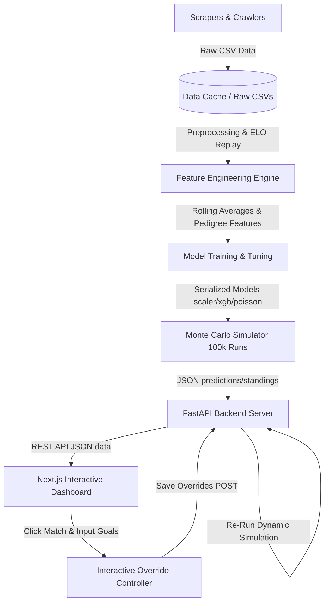
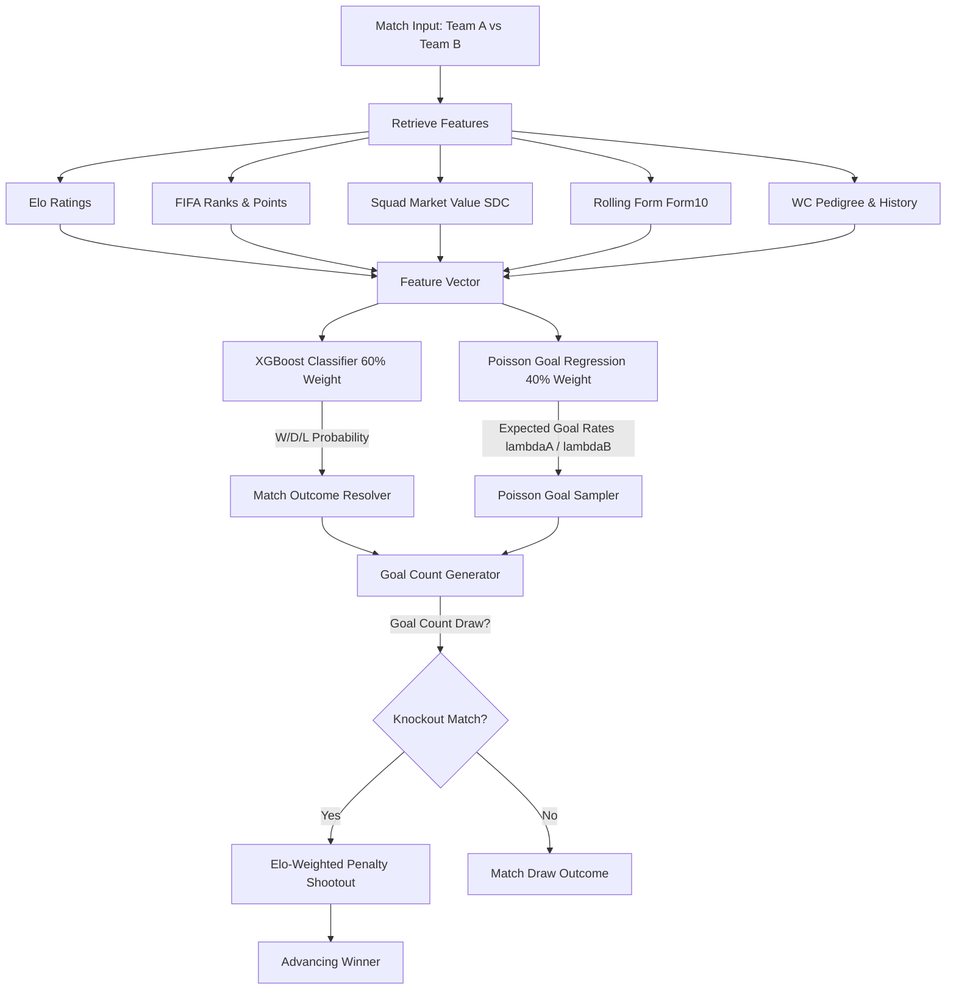

# FIFA World Cup 2026 Prediction System

An end-to-end Machine Learning prediction engine and high-fidelity Monte Carlo tournament simulator for the **FIFA World Cup 2026** (based on the confirmed 48-team, 12 groups of 4 format).

---

## 🏗️ System Architecture

Our prediction system is divided into five logical layers, ensuring separation of concerns between raw data ingestion, model training, tournament simulation, and interactive visual representation:



```
DATA LAYER (Scrapers & CSV caches)
  ├── scrapers/           - Modular web crawlers (Matches, Rankings, Transfermarkt, Wikipedia)
  ├── raw_data/           - Unprocessed Kaggle and scraped CSV files
  └── processed_data/     - Clean master datasets and train/val/test splits

ML LAYER (XGBoost, Poisson & ELO Engine)
  ├── preprocessing/      - Chronological ELO calculation and rolling form replayer
  ├── features/           - Multi-tier features (squad values, overlaps) and correlation selectors
  ├── models/             - Serialised tuned classifiers and expected goal poisson regressions
  └── simulation/         - Vectorised Monte Carlo tournament simulator (100k iterations)

API LAYER (FastAPI Server)
  └── api/                - REST API serving team metadata, group standings, paths, and overrides

FRONTEND LAYER (Next.js Dashboard)
  └── web/                - Next.js 14 + Tailwind interactive dashboard with ELO simulation sliders
```

---

## ⚡ Pipeline Execution & Step Rationale

To completely train the models, run the simulations, and deploy the application, you can execute the pipeline scripts:
* **Windows (PowerShell):** `./run_pipeline.ps1`
* **macOS/Linux:** `./run_pipeline.sh`

### Step-by-Step Rationale

1. **`scrapers/scrape_matches.py` & `scrape_rankings.py`**
   * *Why:* Ingests historical international matches and FIFA ranking trajectories. This serves as the historical baseline for modeling team strength and form.
2. **`scrapers/scrape_transfermarkt.py` & `scrape_wc_history.py`**
   * *Why:* Scrapes financial rosters and World Cup histories. Market values represent player class and squad depth, while historical tournament titles capture "pedigree" under pressure.
3. **`scrapers/scrape_qualifying.py`**
   * *Why:* Ingests active qualifying results for the 2026 cycle to capture recent momentum leading directly into the tournament.
4. **`preprocessing/build_dataset.py` & `preprocess.py`**
   * *Why:* Merges historical tables, replays historical ELO ratings chronologically, and handles training/validation/testing data splits.
5. **`features/engineer.py` & `select.py`**
   * *Why:* Computes advanced rolling averages (e.g., points per game, clean sheets over the last 10 games) and selects features with high predictive power while removing redundant metrics.
6. **`models/train.py` & `evaluate.py`**
   * *Why:* Trains the blended machine learning model and evaluates metrics on held-out test data (RPS, MAE, and Win/Draw/Loss direction).
7. **`simulation/monte_carlo.py` & `dynamic_simulation.py`**
   * *Why:* Runs 100,000 baseline tournament iterations to capture overall probabilities and executes dynamic Elo fatigue calculations.

---

## 📊 Blended Machine Learning Model

Our prediction engine uses a blended ensemble composed of:
1. **XGBoost Classifier (60% weight):** An optimized gradient-boosted decision tree classifier tuned using **Optuna** over 100 hyperparameter trials. It specializes in predicting the overall match outcome (Win, Draw, or Loss) based on ELO gap, FIFA ranks, squad values, and historical titles.
2. **Poisson Scoreline Regression (40% weight):** Predicts the exact goal distribution for each team using expected goal rates ($\lambda$). 



### Expected Goals Scaling ($\lambda$)
Expected goals are derived by scaling a baseline scoring rate against the Elo differential between the competing nations:
$$\lambda_A = \max(0.3, 1.3 + \frac{\text{Elo}_A - \text{Elo}_B}{500})$$
$$\lambda_B = \max(0.3, 1.3 - \frac{\text{Elo}_A - \text{Elo}_B}{500})$$

---

## 🔄 Dynamic Fatigue & Squad Depth (SDC)

In our dynamic simulation, team Elo ratings fluctuate after every match based on result and physical fatigue. 
$$Elo_{\text{penalty}} = 10 \times \text{Matches Played} \times (1.0 - SDC)$$

The **Squad Depth Capacity (SDC)** scales with a team's financial market value:
$$SDC = \max(0.15, \min(1.0, \frac{\text{Squad Value}}{€600,000,000}))$$

* **Elite squads** (e.g. Brazil, France, England) have SDCs close to $1.0$, suffering almost **zero Elo decay** as they progress.
* **Underdog squads** (low market values) suffer heavy fatigue penalties, naturally replicating real-world squad rotation struggles in deep tournament runs.

---

## 🗺️ Official FIFA 2026 Knockout Bracket Mappings

The system strictly conforms to the official **FIFA World Cup 2026 bracket schedule**:
* **Round of 32 (Matches 73-88):** Pairs group stage qualifiers (top 2 from groups A-L and the 8 best 3rd-place wildcards assigned using FIFA's anti-group-rematch allocation rules).
* **Round of 16 (Matches 89-96):**
  * *Match 89:* Winner 74 vs. Winner 77
  * *Match 90:* Winner 73 vs. Winner 75
  * *Match 91:* Winner 76 vs. Winner 78
  * *Match 92:* Winner 79 vs. Winner 80
  * *Match 93:* Winner 83 vs. Winner 84
  * *Match 94:* Winner 81 vs. Winner 82
  * *Match 95:* Winner 86 vs. Winner 88
  * *Match 96:* Winner 85 vs. Winner 87
* **Quarter-finals (Matches 97-100):**
  * *Match 97:* Winner 89 vs. Winner 90
  * *Match 98:* Winner 93 vs. Winner 94
  * *Match 99:* Winner 91 vs. Winner 92
  * *Match 100:* Winner 95 vs. Winner 96
* **Semi-finals (Matches 101-102):**
  * *Match 101:* Winner 97 vs. Winner 98
  * *Match 102:* Winner 99 vs. Winner 100
* **Final (Match 104):** Winner 101 vs. Winner 102

---

## 🎮 How to Use the Interactive Bracket

Our frontend dashboard provides a visual, fully interactive sandbox for tournament scenarios:

1. **View Matchups:** Hover over any node in the bracket tree to inspect teams, their stage progression probabilities, and simulated expected goal ratings.
2. **Override Scores:** Click on **any match card** at any tournament stage. An override modal will appear allowing you to input a custom goals scoreline.
3. **Trigger Recalculation:** Click **Save**. The backend automatically intercepts your override, runs the ELO replayer, cascades the newly decided winner forward, and updates every subsequent matchup and championship probability dynamically.
4. **Wipe Sandbox:** Click the red **✕ Reset All Overrides** button in the header at any time to clear your custom results and restore the baseline ML predictions.

---

## 🏆 Model Outcomes & Predictions Summary

### 1. Championship Odds (Top Contenders)
Across our 100,000 baseline Monte Carlo simulations, the top contenders emerged with the following overall trophy odds:
* **#1 France:** **`20.6%`**
* **#2 Argentina:** **`16.2%`**
* **#3 Spain:** **`10.5%`**
* **#4 England:** **`9.8%`**
* **#5 Brazil:** **`8.4%`**

### 2. The Baseline Bracket Path
Under the most likely, deterministic baseline timeline:
* **Round of 32:** Brazil cruises past Japan **2–0**; Argentina draws with Uruguay **1–1** but falls on penalties.
* **Round of 16:** Portugal edges past Spain **1–0**; Brazil shuts out Senegal **2–0**.
* **Quarter-finals:** England puts on a masterclass to beat Brazil **4–2**; Uruguay beats Portugal **3–2**.
* **Final:** **England** beats **Australia** **1–0** to lift the World Cup.
